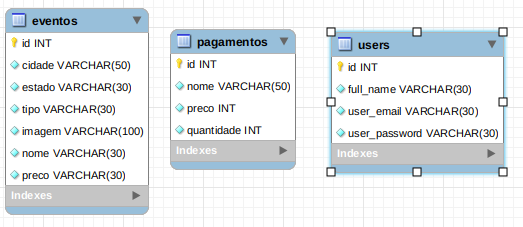
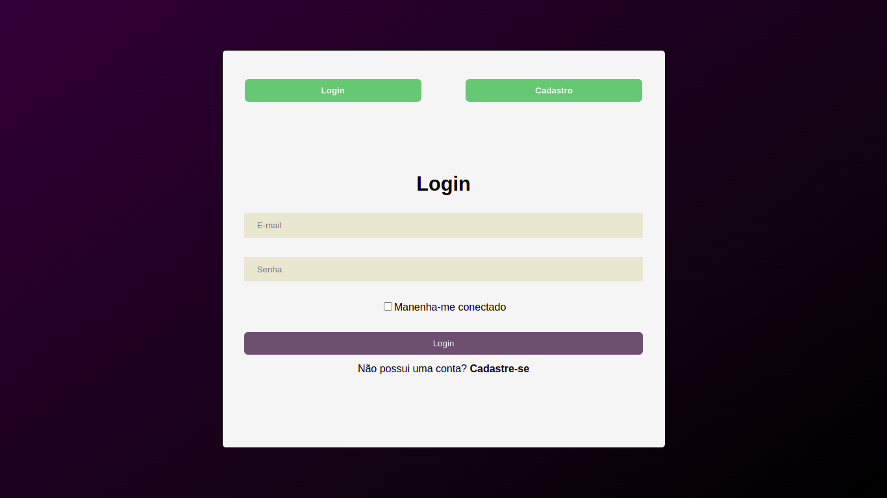
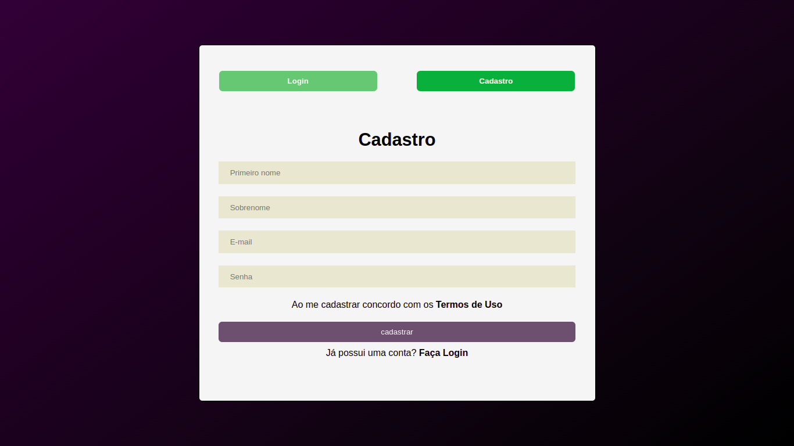
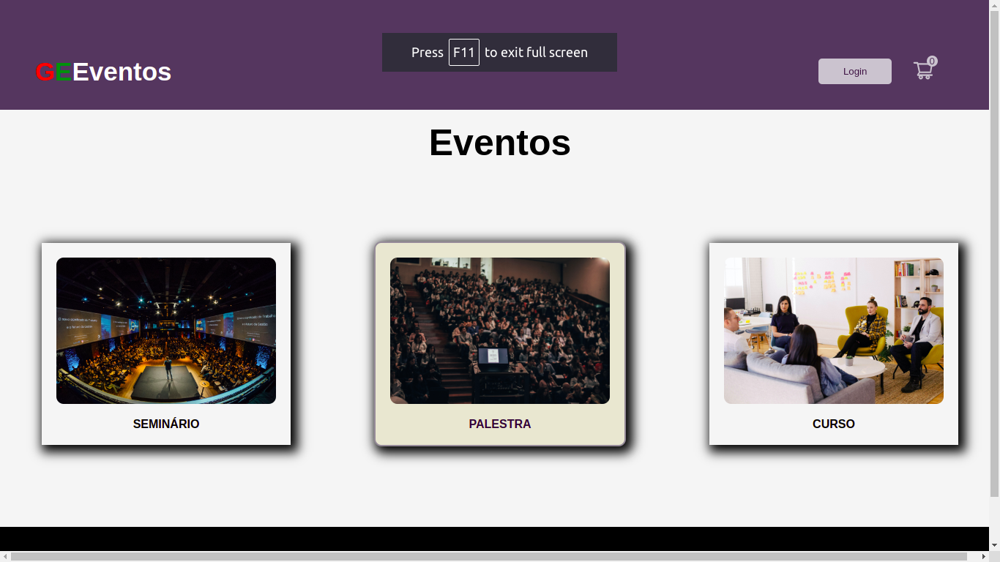
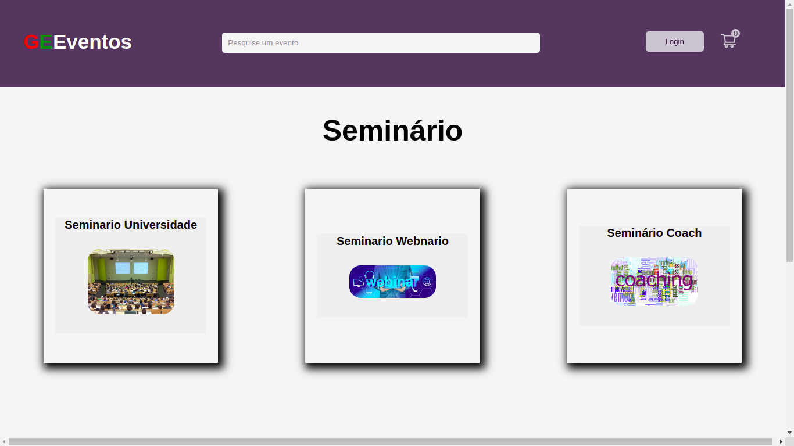
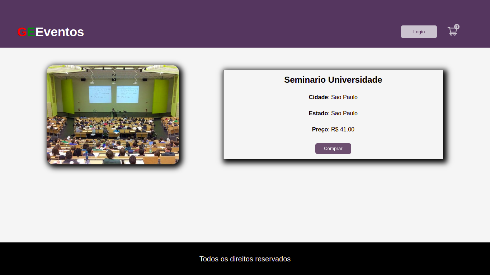
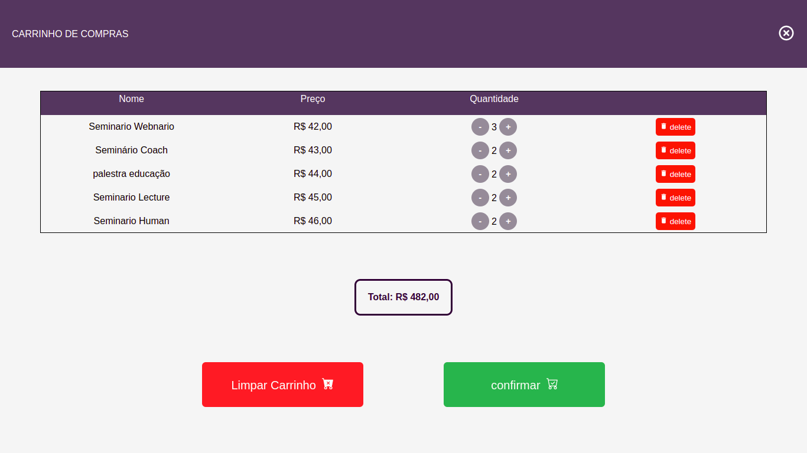

## As dependências devem ser instaladas:

<b>Root</b>: npm install

<b>Front</b>: npm install

<b>Back</b>: npm install

## Informações Gerais:

  

    <strong>🗓 Data de Entrega</strong>
  
 
  
  - Este projeto é individual;
  - Serão `7 dias de projeto;
  - Data de entrega para avaliação final do projeto: `03/08/2022 15:00`.

## Objetivo:

Criação de um aplicativo de gestão de eventos;  
O usuário deve fazer o login;  
Caso não tenha, deve fazer o cadastro;  
Ao entrar na página, deve escolher entre uma das 3 opções disponíveis;  
O usuário será direcionado para uma página com eventos da categoria escolhida.  
Ao escolher uma categoria será direcionado para uma página com mais detalhes da referida categoria.  
Nessa página irá encontrar um botão que irá permitir a compra do evento escolhido.  
Caso queira ir para o carrinho de compra, deve clicar no icone que se encontra na parte superior.  
Dentro da página de carrinho de compra, o usuário pode aumentar a quantidade de itens, excluir um item ou excluir todos os itens.  
Se o usuário clicar no botão de fechar, irá retornar para a página principal.  

## Tecnologias:

<b>Frontend</b>: React/Context
 
<b>Backend</b>: Node/Express

### FrontEnd:

  

    <strong>Frontend estrutura:</strong>
  
 
  <ul>
    <li>Events</li>
    <li>EventsDetails</li>
    <li>Home</li>
    <li>MainLogin</li>
    <li>ShoppingCart</li>
  </ul>

### Backend: Nodejs

  

    <strong>Backend estrutura:</strong>
  
 
  <ul>
  <li>Model</li>
  <li>Service</li>
  <li>Controller</li>
  <li>Middleware</li>
  <li>Route</li>
  </ul>

  
  
  
  
  
  
