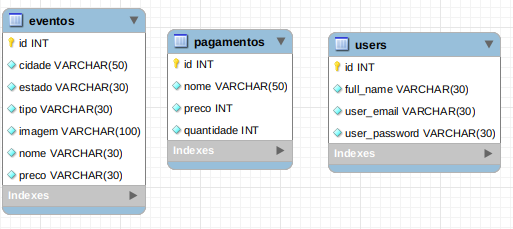

Front: npm install

Back: npm install

Objetivo: Criação de um aplicativo de gestão de eventos;

Tecnologias:

  

    <strong>🗓 Data de Entrega</strong>
  
 
  
  - Este projeto é individual;
  - Serão `7 dias de projeto;
  - Data de entrega para avaliação final do projeto: `03/08/2022 15:00`.

### FrontEnd:

### Backend: Nodejs

  

    <strong>Backend estrutura:</strong>
  
 
  Model
  Service
  Controller
  Middleware
  Route

